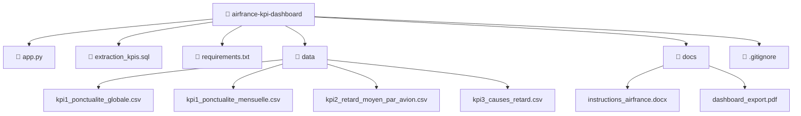

# airfrance-kpi-dashboard

Dashboard interactif développé pour visualiser les KPI de ponctualité à partir des données de vols fournies dans le cadre du processus de recrutement Air France.

## Objectifs

Le projet vise à analyser les données opérationnelles de vols (fichiers CSV et JSON fournis) et restituer les KPI suivants :

- **KPI 1** : Taux de ponctualité au départ (D0)
- **KPI 2** : Retard moyen à l’arrivée par type d’avion
- **KPI 3** : Principales causes de retard sur les vols nationaux

## Structure du projet



## Outils utilisés

-  Streamlit (dashboard)

-  Pandas / Plotly / Seaborn (analyse & visualisation)

-  DuckDB (traitement SQL local)

-  DBeaver (interface pour requêtes SQL)


## Lancement du dashboard localement

1-  Cloner le dépôt

```bash
git clone git@github.com:barry03/airfrance-kpi-dashboard.git
cd airfrance-kpi-dashboard
```

2-  Créer un environnement Python
```bash
python3 -m venv venv
source venv/bin/activate
```

2-  Installer les dépendances
```bash
pip install -r requirements.txt
```

4-  Lancer Streamlit
```bash
streamlit run app.py
```

##  Déploiement en ligne

Le dashboard interactif est disponible en ligne via Streamlit Cloud :

[https://airfrance-kpi-dashboard-p3tp2nkxp3lxbefpjthikv.streamlit.app](https://airfrance-kpi-dashboard-p3tp2nkxp3lxbefpjthikv.streamlit.app)


## 👨‍💻 Auteur

Projet réalisé par Djoulde Barry dans le cadre d’un processus de recrutement chez Air France.

## 🙏 Remerciements

Merci à l’équipe Air France pour cette étude de cas riche et pertinente.
